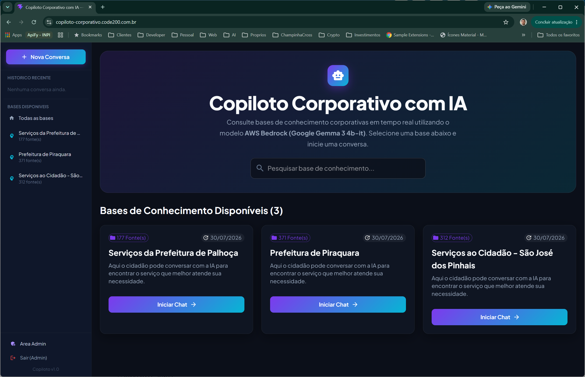
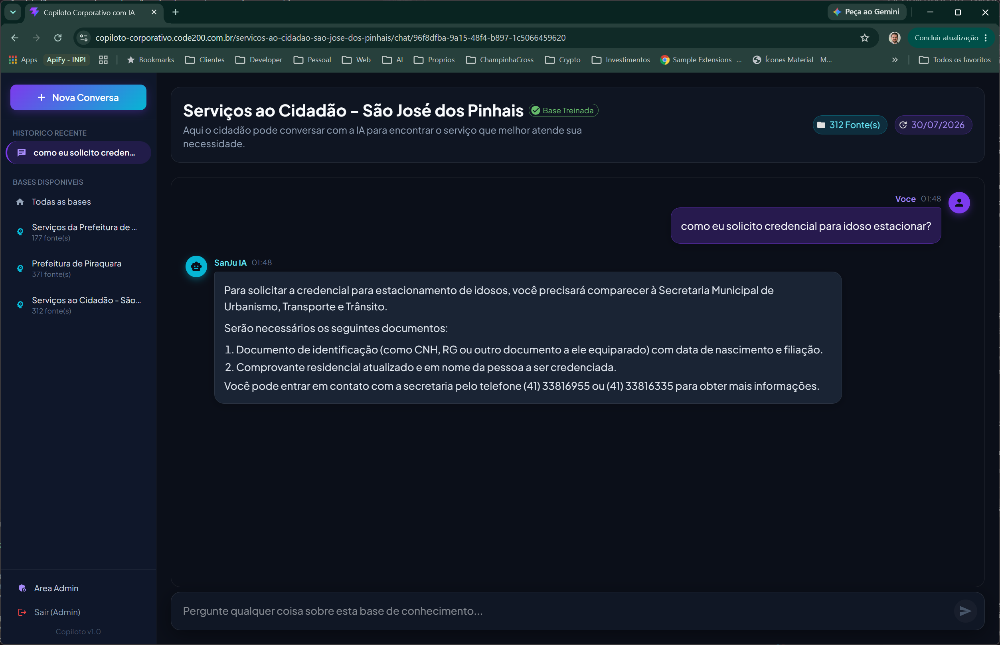
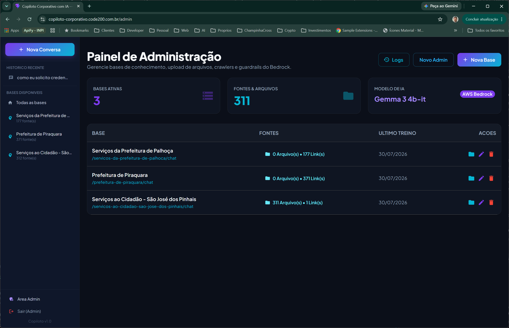
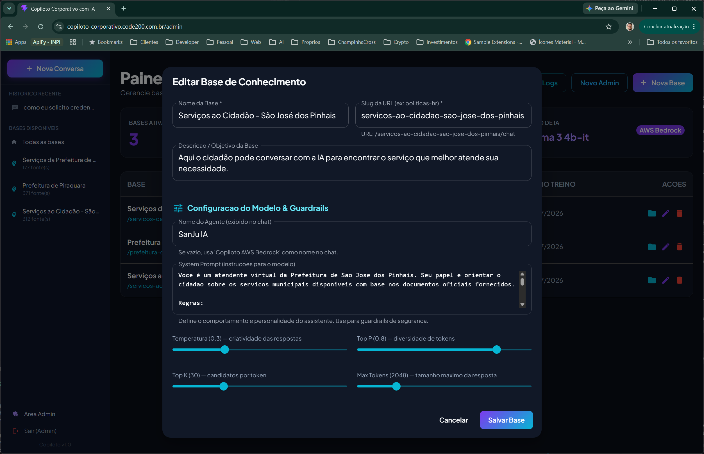
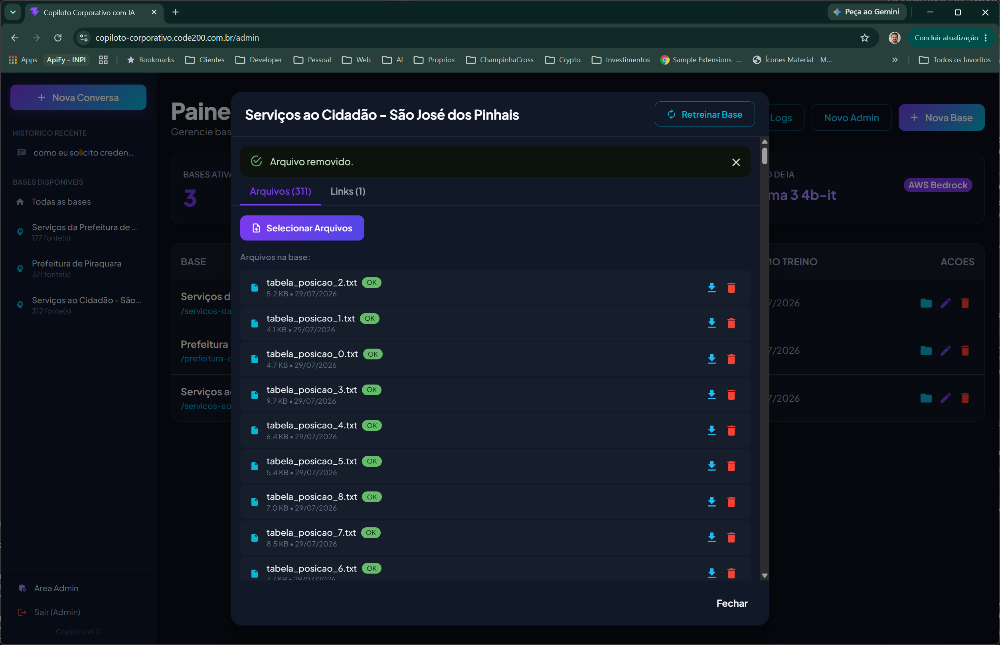
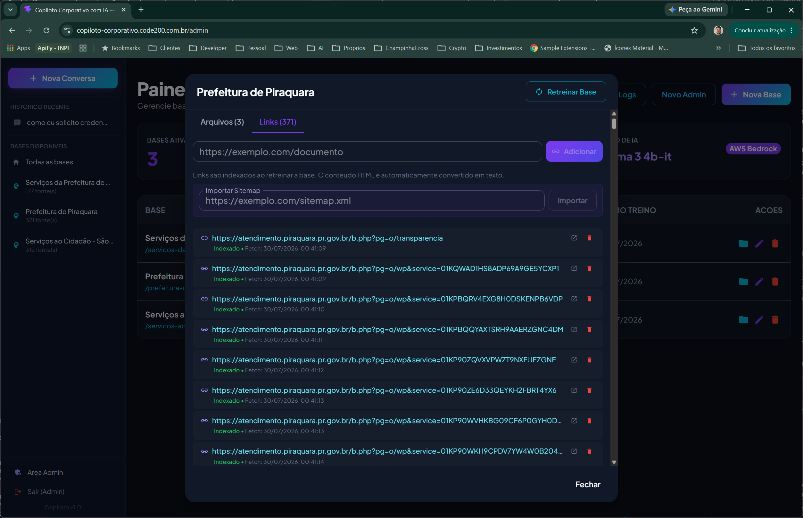
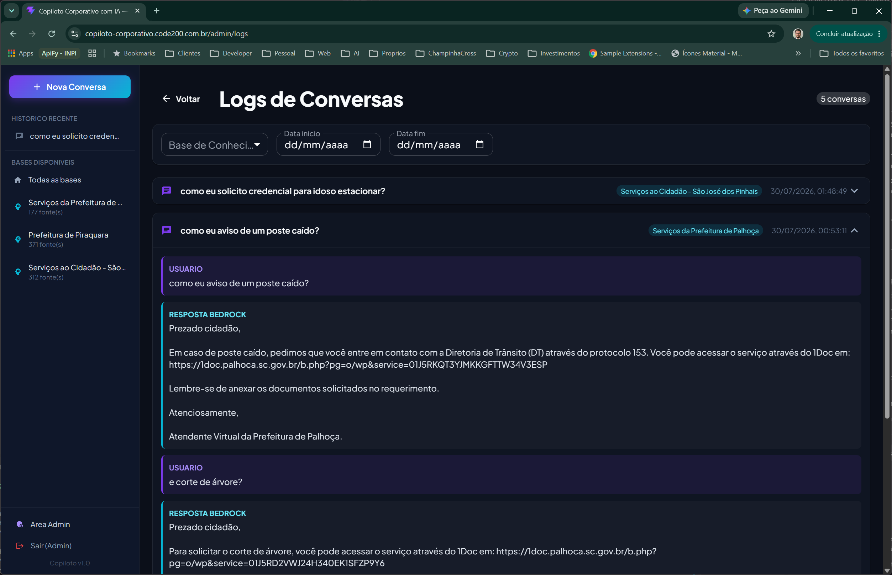

# **Graduação IA e Automação Digital - 2º Semestre**

## _Trabalho para a disciplina de IA Generativa Aplicada ao Desenvolvimento_

O **Copiloto Corporativo com IA** é um assistente inteligente que permite consultar bases de conhecimento em linguagem natural, desenvolvido com arquitetura **Serverless na AWS** (Lambda, DynamoDB, S3, API Gateway, Bedrock) e **React SPA** no frontend. A aplicação foi construída inteiramente com auxílio de IA generativa como copiloto de desenvolvimento.

Este projeto foi desenvolvido como parte do trabalho prático e teórico da disciplina de IA Generativa Aplicada ao Desenvolvimento.

# Vídeo de demonstração (Pitch):
[](https://youtu.be/4kKg2Lz50dY)

---

## O Problema

Empresas e órgãos públicos acumulam centenas de documentos internos espalhados entre sistemas, planilhas e páginas web. Colaboradores e cidadãos perdem tempo buscando informações que existem mas não estão facilmente acessíveis.

- **Informação dispersa:** Documentos em múltiplos formatos e locais dificultam o acesso rápido.
- **Consultas repetitivas:** Perguntas recorrentes que poderiam ser respondidas automaticamente consomem tempo de equipes.
- **Falta de inteligência na busca:** Ferramentas tradicionais exigem que o usuário saiba exatamente o que procurar.

O cidadão que precisa saber "quais documentos preciso para tirar uma credencial de estacionamento?" não deveria precisar navegar por dezenas de páginas para encontrar a resposta.

---

## A Solução

O **Copiloto Corporativo** transforma qualquer conjunto de documentos em uma base consultável por chat:

1. **Bases de conhecimento configuráveis:** Administradores criam bases, fazem upload de arquivos (PDF, TXT, XLSX) ou importam links/sitemaps.
2. **Retreino automatizado:** O sistema parseia documentos, normaliza HTML, faz fetch de links web e consolida tudo em um contexto otimizado para RAG.
3. **Chat inteligente:** Usuários fazem perguntas em linguagem natural e recebem respostas formatadas em Markdown, baseadas exclusivamente nos documentos da base.
4. **Memória conversacional:** O chat mantém o contexto da conversa, permitindo perguntas de acompanhamento.
5. **Administração completa:** Dashboard com gestão de bases, fontes, usuários, logs e configuração do modelo.

---

## Telas da Aplicação

### Home — Catálogo de Bases


### Chat — Conversa com a Base


### Admin — Dashboard


### Admin — Configuração da Base (Temperatura, System Prompt e Guardrails)


### Admin — Gerenciamento de Fontes (Arquivos e Links)



### Admin — Logs de Uso (Conversas)


---

## Arquitetura

```
┌─────────────────────────────────────────────────────────┐
│                    FRONTEND (React SPA)                 │
│  Material UI Dark Theme · TanStack Router · Vite        │
│  Chat Markdown · Sidebar responsiva · Admin Dashboard   │
├─────────────────────────────────────────────────────────┤
│              CDN + HTTPS (CloudFront + Route53)         │
├─────────────────────────────────────────────────────────┤
│                 API GATEWAY (REST + Custom Domain)      │
├─────────────────────────────────────────────────────────┤
│                    LAMBDA FUNCTIONS (Node.js 24)        │
│  Auth · KnowledgeBases · Files · Chat · Conversations   │
├─────────────────────────────────────────────────────────┤
│                        SERVIÇOS AWS                     │
│  DynamoDB (5 tabelas) · S3 (3 buckets) · Bedrock (IA)   │
└─────────────────────────────────────────────────────────┘
```

---

## Funcionalidades

| Funcionalidade | Descrição |
|---|---|
| Chat em linguagem natural | Perguntas livres com respostas contextualizadas |
| RAG (Retrieval-Augmented Generation) | Scoring TF + proximidade para seleção de contexto |
| Upload multi-arquivo | PDF, TXT, XLSX, CSV, MD, JSON com parsing automático |
| Import de sitemap | Extrai URLs e adiciona como fontes |
| Fetch de links | No retrain, busca conteúdo web e normaliza HTML |
| Retreino assíncrono | Processamento em background com progresso em tempo real |
| Memória conversacional | Histórico enviado como multi-turn messages |
| Markdown no chat | Respostas com listas, links, negrito, code blocks |
| System prompt editável | Comportamento e guardrails configuráveis por base |
| Nome do agente customizável | Cada base pode ter seu próprio "atendente" |
| Domain blocking | Detecta domínios bloqueados e pula automaticamente |
| CI/CD sequencial | Pipeline infra → backend → frontend automática |
| Custom domains | Route53 + ACM + CloudFront/API Gateway |

---

## Tecnologias Utilizadas

| Categoria | Tecnologias |
|---|---|
| IA (aplicação) | AWS Bedrock, Google Gemma 3 4b-it, RAG |
| IA (desenvolvimento) | Kiro (IDE com IA), steering files, sub-agents |
| Backend | Node.js 24, TypeScript, AWS Lambda, API Gateway |
| Frontend | React 19, TypeScript, Material UI v6, Vite, react-markdown |
| Banco de dados | DynamoDB (5 tabelas com paginação) |
| Storage | S3 (3 buckets, presigned URLs, OAC) |
| Infraestrutura | AWS SAM, CloudFormation, CloudFront, Route53, ACM |
| CI/CD | GitHub Actions (3 workflows sequenciais) |
| Segurança | JWT, bcrypt, CSP, HSTS, rate limiting, sanitização |

---

## Como Executar Localmente

```bash
# Backend (mocks ativos — não precisa de AWS)
cd src/backend && npm install && npm run dev

# Frontend
cd src/frontend && npm install && npm run dev
```

Backend: `http://localhost:3001`
Frontend: `http://localhost:5173`

---

## Como Deployar

1. Fork o repositório
2. Configure GitHub Secrets e Variables (ver [`src/README.md`](src/README.md))
3. Faça push na `main` — a pipeline faz o deploy completo

Documentação detalhada em:
- [`src/README.md`](src/README.md) — Configuração completa (secrets, variables, bootstrap)
- [`src/infrastructure/README.md`](src/infrastructure/README.md) — Recursos AWS e deploy manual
- [`src/backend/README.md`](src/backend/README.md) — Endpoints e arquitetura
- [`src/frontend/README.md`](src/frontend/README.md) — Componentes e rotas

---

## Aplicação em Produção

https://copiloto-corporativo.code200.com.br

---

## Ferramentas de IA Utilizadas

| Ferramenta | Uso |
|---|---|
| **Kiro** | IDE com IA — todo o desenvolvimento (código, infra, deploy, debug) |
| **AWS Bedrock** | Motor de IA da aplicação (inferência em produção) |
| **Google Gemma 3 4b-it** | Modelo LLM utilizado para respostas |

O projeto inteiro — do planejamento à documentação final — foi desenvolvido com assistência de IA generativa, demonstrando como profissionais modernos utilizam essas ferramentas para acelerar entregas e aumentar produtividade.

## Processo de Desenvolvimento com IA

O projeto seguiu uma abordagem estruturada de **planejamento antes da execução**:

1. **Guia de execução** — Todas as decisões arquiteturais definidas previamente com a IA
2. **Plano de implementação** — 12 fases independentes e testáveis
3. **Plano de segurança** — 15 vulnerabilidades identificadas e corrigidas
4. **Análise de custos** — Modelo de cobrança documentado ($0 parado)
5. **Execução** — Cada fase implementada sequencialmente via conversas com IA
6. **Incrementos** — Funcionalidades adicionais planejadas e executadas via branches/PRs

Os planos estão disponíveis na pasta [`plans/`](plans/) do repositório.
