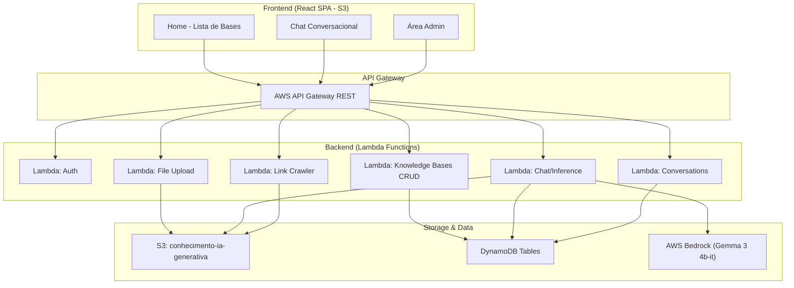

# 🚀 Copiloto Corporativo com IA — Plano de Implementação

Construção de um **assistente corporativo inteligente** que permite consultar bases de conhecimento em linguagem natural, utilizando AWS Bedrock (Gemma 3 4b-it), arquitetura Serverless e React no frontend.

---

## Visão Geral da Arquitetura



---

## Estrutura de Diretórios Final

```
/src/
├── infrastructure/          # SAM/CloudFormation templates
│   ├── template.yaml        # Definição de todos os recursos AWS
│   └── README.md
├── backend/
│   ├── src/
│   │   ├── handlers/        # Handlers Lambda (entry points)
│   │   ├── services/        # Lógica de negócio
│   │   ├── utils/           # Utilitários (auth, response, parsers)
│   │   └── mocks/           # Mocks locais (Bedrock, S3, DynamoDB)
│   ├── tests/               # Testes unitários e integração
│   ├── package.json
│   ├── tsconfig.json
│   └── README.md
├── frontend/
│   ├── src/
│   │   ├── components/      # Componentes React
│   │   ├── pages/           # Páginas (Home, Chat, Admin)
│   │   ├── hooks/           # Custom hooks (TanStack Query)
│   │   ├── services/        # API client
│   │   ├── theme/           # Material UI theme
│   │   └── router/          # TanStack Router
│   ├── public/
│   ├── package.json
│   └── README.md
/.github/
│   └── workflows/
│       ├── deploy-infra.yml
│       ├── deploy-backend.yml
│       └── deploy-frontend.yml
```

---

## Fases de Implementação

> [!IMPORTANT]
> Cada fase é **independente e testável**. Só avançamos para a próxima fase após validar a anterior.

---

### FASE 1 — Infraestrutura Base (IaC)
**Objetivo:** Definir todos os recursos AWS como código e validar que o template é válido.

| Etapa | O que fazer | Como testar |
|-------|-------------|-------------|
| 1.1 | Criar [template.yaml](file:///d:/cursos/graduacao-ia/graduacao-10-ia-generativa-aplicada-ao-desenvolvimento/src/infrastructure/template.yaml) com SAM (Serverless Application Model) | `sam validate` — deve retornar "valid" |
| 1.2 | Definir DynamoDB Tables: `KnowledgeBases`, `Conversations`, `Messages`, `Users` | Template válido com 4 tabelas definidas |
| 1.3 | Definir S3 Bucket `conhecimento-ia-generativa` | Recurso presente no template |
| 1.4 | Definir S3 Bucket para frontend SPA (hosting estático) | Recurso presente no template |
| 1.5 | Definir Lambda Functions (stubs) + API Gateway | Endpoints listados no `sam local` |
| 1.6 | Configurar IAM Roles e Policies para Bedrock, S3, DynamoDB | Policies no template |
| 1.7 | Criar [README.md](file:///d:/cursos/graduacao-ia/graduacao-10-ia-generativa-aplicada-ao-desenvolvimento/src/infrastructure/README.md) da infraestrutura | Documento legível |

**Entregável:** Template SAM válido + README explicativo

---

### FASE 2 — Backend: Foundation Layer
**Objetivo:** Criar o esqueleto do backend com mocks locais para testar sem AWS.

| Etapa | O que fazer | Como testar |
|-------|-------------|-------------|
| 2.1 | Inicializar projeto Node.js + TypeScript em `/src/backend/` | `npm run build` compila sem erros |
| 2.2 | Criar utilitários: response builder, error handler, auth middleware | Testes unitários passam |
| 2.3 | Criar camada de mocks locais (DynamoDB local, S3 local, Bedrock mock) | Mock de Bedrock retorna resposta fake ao receber prompt |
| 2.4 | Criar variáveis de ambiente `.env` para modo local vs. produção | `npm run dev` inicia servidor local |

**Entregável:** Backend compilável, testável localmente com mocks

---

### FASE 3 — Backend: Auth + Usuários Admin
**Objetivo:** Implementar autenticação e CRUD de usuários admin.

| Etapa | O que fazer | Como testar |
|-------|-------------|-------------|
| 3.1 | Handler `POST /auth/login` — login com email/senha, retorna JWT | `curl POST /auth/login` retorna token |
| 3.2 | Handler `POST /auth/register` — criar usuário admin | `curl POST /auth/register` cria no mock |
| 3.3 | Middleware de autenticação JWT nos endpoints admin | Request sem token retorna 401 |
| 3.4 | Service `UserService` com hash de senha (bcrypt) | Teste unitário: hash != plaintext, verify ok |

**Entregável:** Auth funcional testável via curl/Postman

---

### FASE 4 — Backend: Bases de Conhecimento (CRUD)
**Objetivo:** CRUD completo de bases de conhecimento + upload de arquivos.

| Etapa | O que fazer | Como testar |
|-------|-------------|-------------|
| 4.1 | Handler `POST /admin/knowledge-bases` — criar base (nome, slug, descrição, configs Bedrock) | curl retorna base criada com UUID |
| 4.2 | Handler `GET /admin/knowledge-bases` — listar bases | curl retorna array de bases |
| 4.3 | Handler `GET /admin/knowledge-bases/:id` — detalhe da base | curl retorna base específica |
| 4.4 | Handler `PUT /admin/knowledge-bases/:id` — editar base | curl atualiza dados |
| 4.5 | Handler `DELETE /admin/knowledge-bases/:id` — remover base | curl remove base e pasta S3 |
| 4.6 | Handler `POST /admin/knowledge-bases/:id/files` — upload de arquivo (PDF, TXT, XLSX) | curl envia arquivo, aparece no mock S3 |
| 4.7 | Handler `DELETE /admin/knowledge-bases/:id/files/:fileId` — remover arquivo | curl remove arquivo |
| 4.8 | Handler `POST /admin/knowledge-bases/:id/links` — adicionar link para crawl | curl adiciona link, mock crawl executa |
| 4.9 | Service de parsing de arquivos (PDF → texto, XLSX → JSON, TXT → texto) | Teste unitário: PDF parseado retorna texto |
| 4.10 | Handler `POST /admin/knowledge-bases/:id/retrain` — retreinar base manualmente | curl dispara retreino, atualiza `lastTrainedAt` |

**Entregável:** API de gestão de bases completa, testável localmente

---

### FASE 5 — Backend: Chat e Inferência
**Objetivo:** Endpoint de chat que consulta a base de conhecimento e responde via Bedrock.

| Etapa | O que fazer | Como testar |
|-------|-------------|-------------|
| 5.1 | Handler `POST /chat/:slug` — iniciar ou continuar conversa | curl envia mensagem, recebe resposta (mock Bedrock) |
| 5.2 | Service `ChatService` — monta prompt com contexto da base (RAG simples) | Teste: prompt inclui trechos relevantes dos documentos |
| 5.3 | Service `BedrockService` — abstração para chamar Bedrock (com fallback para mock) | Teste: em modo local usa mock, retorna resposta |
| 5.4 | Handler `GET /conversations/:uid` — listar conversas do usuário (por UID localStorage) | curl retorna conversas do UID |
| 5.5 | Handler `GET /conversations/:uid/:conversationId` — detalhes da conversa | curl retorna mensagens da conversa |
| 5.6 | Implementar guardrails configuráveis (temperatura, top_p, top_k) lidos da base | Teste: parâmetros passados ao Bedrock corretamente |

**Entregável:** Chat funcional E2E com mock → pronto para trocar por Bedrock real

---

### FASE 6 — Backend: Endpoints Públicos
**Objetivo:** APIs públicas para o frontend consumir.

| Etapa | O que fazer | Como testar |
|-------|-------------|-------------|
| 6.1 | Handler `GET /knowledge-bases` — listar bases públicas (nome, descrição, slug, fileCount, lastUpdated) | curl retorna lista formatada |
| 6.2 | Handler `GET /knowledge-bases/:slug` — detalhe público da base | curl retorna dados da base |
| 6.3 | Handler `GET /admin/logs` — log de conversas para admin | curl retorna logs (protegido por auth) |

**Entregável:** Todos os endpoints que o frontend precisa estão funcionais

---

### FASE 7 — Frontend: Setup + Design System
**Objetivo:** Inicializar React SPA com Material UI, TanStack Router e theme premium.

| Etapa | O que fazer | Como testar |
|-------|-------------|-------------|
| 7.1 | Criar projeto Vite + React + TypeScript em `/src/frontend/` | `npm run dev` abre no browser |
| 7.2 | Instalar e configurar Material UI (tema dark, paleta personalizada) | Theme aplicado, cores premium |
| 7.3 | Instalar TanStack Router + TanStack Query | Rotas `/`, `/:slug/chat`, `/:slug/chat/:uuid` funcionam |
| 7.4 | Criar layout base: Sidebar + Main Content + AppBar | Layout renderiza corretamente |
| 7.5 | Configurar API client (axios/fetch) apontando para backend local | Request chega no backend |

**Entregável:** App React renderizando com design premium e rotas configuradas

---

### FASE 8 — Frontend: Páginas Públicas
**Objetivo:** Construir a experiência pública do chat (estilo ChatGPT/Gemini).

| Etapa | O que fazer | Como testar |
|-------|-------------|-------------|
| 8.1 | Página Home `/` — grid de cards com bases de conhecimento | Abre no browser, mostra bases do backend |
| 8.2 | Sidebar com histórico de conversas (lê UID do localStorage) | Sidebar mostra conversas anteriores |
| 8.3 | Página Chat `/:slug/chat` — interface de chat com input, mensagens, scroll | Digitar mensagem → aparece na tela |
| 8.4 | Integração chat → backend (`POST /chat/:slug`) | Mensagem enviada → resposta do backend aparece |
| 8.5 | Página Conversa `/:slug/chat/:uuid` — carrega conversa existente | URL direta carrega conversa com histórico |
| 8.6 | Gerar UID no localStorage se não existir | Primeiro acesso cria UID, segundo acesso recupera |

**Entregável:** Experiência pública completa, funcional com backend local

---

### FASE 9 — Frontend: Área Administrativa
**Objetivo:** Dashboard admin protegido por login.

| Etapa | O que fazer | Como testar |
|-------|-------------|-------------|
| 9.1 | Página Login `/admin/login` | Login com credenciais → redireciona para dashboard |
| 9.2 | Proteção de rotas admin (JWT no header) | Acesso sem login → redireciona para login |
| 9.3 | Dashboard `/admin` — listar bases de conhecimento | Tabela com bases, botão criar |
| 9.4 | Formulário criar/editar base | Formulário funcional, salva no backend |
| 9.5 | Área de upload de arquivos por base | Upload funcional, lista arquivos |
| 9.6 | Área de links por base | CRUD de links funcional |
| 9.7 | Configurações de Bedrock por base (temperatura, top_p, top_k) | Sliders/inputs salvam configurações |
| 9.8 | Gestão de usuários admin | CRUD de usuários funcional |
| 9.9 | Página de logs de conversas | Lista de conversas com filtro |
| 9.10 | Botão de retreino manual por base | Clique dispara retreino, atualiza data |

**Entregável:** Painel admin completo e funcional

---

### FASE 10 — CI/CD + Deploy
**Objetivo:** Pipeline automatizado com GitHub Actions.

| Etapa | O que fazer | Como testar |
|-------|-------------|-------------|
| 10.1 | Workflow `deploy-infra.yml` — deploya template SAM | Push na main → infra criada/atualizada |
| 10.2 | Workflow `deploy-backend.yml` — build + deploy das Lambdas | Push na main → lambdas atualizadas |
| 10.3 | Workflow `deploy-frontend.yml` — build React + sync S3 | Push na main → SPA atualizado no S3 |
| 10.4 | Configurar GitHub Secrets (AWS credentials, env vars) | Workflows executam sem erro |

**Entregável:** Deploy automatizado end-to-end

---

### FASE 11 — Integração Real com AWS Bedrock
**Objetivo:** Trocar mocks por serviços AWS reais.

| Etapa | O que fazer | Como testar |
|-------|-------------|-------------|
| 11.1 | Conectar `BedrockService` ao AWS Bedrock real (modelo `google.gemma-3-4b-it`) | Chat retorna resposta do modelo real |
| 11.2 | Conectar DynamoDB real | Dados persistidos entre sessões |
| 11.3 | Conectar S3 real | Upload de arquivos funcional na nuvem |
| 11.4 | Testar RAG end-to-end com documentos reais | Pergunta sobre documento → resposta correta |

**Entregável:** Aplicação 100% funcional na nuvem

---

### FASE 12 — Documentação + README Final
**Objetivo:** Documentação profissional para entrega acadêmica.

| Etapa | O que fazer | Como testar |
|-------|-------------|-------------|
| 12.1 | README.md raiz — visão geral, arquitetura, como rodar | Documento completo e claro |
| 12.2 | README.md do backend — endpoints, como testar | Documento completo |
| 12.3 | README.md do frontend — como rodar, tecnologias | Documento completo |
| 12.4 | README.md da infraestrutura — recursos, como deployar | Documento completo |
| 12.5 | Screenshots da aplicação funcionando | Prints salvos em `/assets/` |

**Entregável:** Documentação pronta para entrega do trabalho

---

## Tecnologias Confirmadas

| Camada | Tecnologia |
|--------|------------|
| **Infra** | AWS SAM, CloudFormation, Infrastructure Composer |
| **Backend** | Node.js + TypeScript, AWS Lambda, API Gateway |
| **Frontend** | React + Vite, Material UI, TanStack Router/Query |
| **IA** | AWS Bedrock, Google Gemma 3 4b-it |
| **Storage** | S3 (`conhecimento-ia-generativa`), DynamoDB |
| **CI/CD** | GitHub Actions |
| **Auth** | JWT + bcrypt |
| **Região** | us-east-1 |

---

## Open Questions

> [!IMPORTANT]
> **Modelo Bedrock por base:** O guia menciona investigar se é necessário criar uma instância do Bedrock para cada base de conhecimento. Pela arquitetura do Bedrock, **não é necessário** — o mesmo modelo pode ser invocado passando contextos diferentes. Cada base terá seus próprios **guardrails** (temperatura, top_p, top_k) armazenados no DynamoDB e passados na chamada ao Bedrock. Concorda com essa abordagem?

> [!IMPORTANT]
> **AWS SAM vs CloudFormation puro:** Recomendo usar **AWS SAM** (Serverless Application Model) pois simplifica a definição de Lambdas + API Gateway e suporta teste local com `sam local invoke`. O Infrastructure Composer da AWS também pode importar templates SAM. Está ok?

> [!WARNING]
> **Credenciais AWS:** Para as fases de deploy real (10 e 11), serão necessárias credenciais AWS configuradas. Para as fases 1–9 trabalharemos 100% com mocks locais. Você já tem uma conta AWS configurada com acesso a Bedrock, S3 e DynamoDB?

> [!NOTE]
> **Abordagem RAG:** Para a consulta inteligente de documentos, usaremos uma implementação de RAG (Retrieval-Augmented Generation) simples — os documentos serão parseados para texto, indexados localmente, e os trechos mais relevantes serão injetados no prompt enviado ao Bedrock. Isso evita dependência de serviços adicionais como OpenSearch/Pinecone.

## Verificação

### Testes por Fase
- Cada fase possui critérios de teste próprios (coluna "Como testar" nas tabelas)
- Backend: testes unitários + curl/Postman para endpoints
- Frontend: verificação visual no browser + DevTools para requests

### Teste End-to-End Final
- Criar base de conhecimento pelo admin
- Fazer upload de PDF de teste
- Acessar chat público pela home
- Enviar pergunta em linguagem natural
- Verificar que a resposta usa conteúdo do PDF
